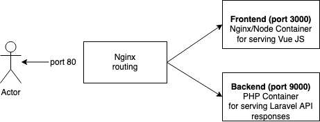

<table align="center">
    <tr style="text-align: center;">
        <td align="center" width="9999">
            

 <h1 style="color: black;"> App user Management</h1>

Building A Vue Front End For A Laravel API/mongodb

</td>
</tr>
</table>

## 1. Install Dependencies
